# KataGo-LLM-Team: GRPO-Aligned 9×9 Go AI

**Training:** [Qwen3-8B](https://huggingface.co/Qwen/Qwen3-8B) + GRPO (v4 pipeline) · **Edge deployment:** Q4_K_M GGUF on 8GB VRAM via LM Studio + C++ GTP proxy + Lizzie

[](https://www.python.org/)
[](https://pytorch.org/)
[](https://github.com/huggingface/trl)
[](https://github.com/ggerganov/llama.cpp)
[](https://wandb.ai/brighton_zz-uc-san-diego/huggingface/runs/eb6zhzfo)

> **Repo guide for contributors:** up-to-date paths, commands, and pipeline details live in [`.cursorrules`](.cursorrules).

---

## About The Project

https://github.com/user-attachments/assets/441f4623-8106-4288-a5b3-990be05d6aae

This project bridges two challenges: **algorithmic alignment for spatial reasoning** on a 9×9 Go board and **model compression for edge deployment**.

Large language models are not naturally equipped for spatial board games — they lack reliable 2D coordinate reasoning, empty-intersection awareness, and tactical structure. We use [KataGo](https://github.com/lightvector/KataGo) as an **expert teacher for data generation only** (not at inference) and train with **Group Relative Policy Optimization (GRPO)**.

**Current pipeline (v4):** [Qwen3-8B](https://huggingface.co/Qwen/Qwen3-8B) is trained on a rebuilt dataset (`prepare_v4_dataset.py` → `data/training_data_v4.jsonl`) with **valid empty coordinates restored** in every prompt, **lopsided positions downsampled** (root winrate above 0.95 or below 0.05 kept at 30%), and a **redesigned reward**: partial-credit format/legality gate + **log-scaled KataGo policy** + **scoreLead percentile rank** among legal moves, with weights **adapted by position closeness** (`root_winrate` near 0.5 vs. decided games). Outputs use `REASONING:` + `MOVE:`; Qwen3 native thinking is **disabled** in chat templates (`enable_thinking=False`) so completions stay within budget. See [`src/model_training/train_grpo_v4.py`](src/model_training/train_grpo_v4.py).

The fine-tuned model is **quantized to 4-bit GGUF** and deployed locally via **LM Studio** and a **C++ GTP proxy** that bridges GTP commands from **Lizzie** (Go GUI) to the LLM's OpenAI-compatible API — real-time inference on consumer GPUs with no cloud dependency.

---

## Key Features & Highlights

* **GRPO on Qwen3-8B (v4):** KataGo-grounded rewards combining a **format & empty-intersection gate** (partial credit) with a **composite** of log-scaled move policy and **rank-by-scoreLead** over evaluated legal moves, plus adaptive mixing from root-position winrate. Training: [`train_grpo_v4.py`](src/model_training/train_grpo_v4.py), rollouts: `src/model_training/logs/grpo_training_rollouts_v4.jsonl`, checkpoints: `runs/Qwen3-8B-GRPO-Go-Pro-v4/`.

* **Edge deployment (Qwen3-8B v4 — proven):** Automated pipeline merges LoRA and compresses to 4-bit **`Q4_K_M` GGUF** (~5GB). Runs on **8GB VRAM** consumer GPUs via LM Studio. C++ GTP proxy maintains full board state with **Go capture logic**, renders **ASCII board prompts** matching training format, and outputs **model reasoning to Lizzie's GTP Console** in real time.

* **Base model comparison:** A second proxy (`gtp_proxy_v4_base.exe`) loads the **un-fine-tuned Qwen3-8B** GGUF for side-by-side comparison against the fine-tuned model in Lizzie.

* **C++ GTP proxy:** Standalone executables (`cpp-httplib`) forward GTP from Lizzie to LM Studio's OpenAI-compatible API — no Python on the inference hot path. `<think>` tags stripped automatically; reasoning text shown via stderr.

* **Legacy scripts:** [`train_grpo_v3.py`](src/model_training/train_grpo_v3.py) (v3 composite reward, `max_completion_length` 1024); [`train_grpo.py`](src/model_training/train_grpo.py) (v1 four-layer outcome-regret stack, ~5k augmented examples from a small curated set).

---

## HuggingFace Artifacts

### Repos at a glance

| Repo | What's in it | Who needs it |
|------|-------------|--------------|
| [brightonliuzZ/qwen3-8b-go-v4](https://huggingface.co/brightonliuzZ/qwen3-8b-go-v4) | Full-precision merged model + **Q4_K_M GGUF** | Everyone (see below) |
| [brightonliuzZ/qwen2.5-7b-go](https://huggingface.co/brightonliuzZ/qwen2.5-7b-go) | Legacy 7B full-precision merged model + **Q4_K_M GGUF** | Legacy users |
| [brightonliuzZ/grpo-go-checkpoints](https://huggingface.co/brightonliuzZ/grpo-go-checkpoints) | Raw LoRA checkpoints (v1/v2/v3) | Researchers resuming training |
| [brightonliuzZ/katago-grpo-datasets](https://huggingface.co/datasets/brightonliuzZ/katago-grpo-datasets) | v3 augmented training data | Data / research use |
| [brightonliuzZ/qwen2.5-7b-and-qwen3-8b-go-GGUF-legacy](https://huggingface.co/brightonliuzZ/qwen2.5-7b-and-qwen3-8b-go-GGUF-legacy) | Older GGUF releases | Historical reference |

### What are all these files?

Each model repo (`qwen3-8b-go-v4`, `qwen2.5-7b-go`) contains two categories of files:

**Category 1 — GGUF file (what most users want)**

| File | Size | Purpose |
|------|------|---------|
| `qwen3-8b-go-v4-Q4_K_M.gguf` | ~5 GB | 4-bit quantized model. **Load directly in LM Studio** to play Go via Lizzie. Runs on 8GB VRAM. |
| `qwen-7b-go-Q4_K_M.gguf` | ~4.5 GB | Same idea, legacy 7B model. |

**→ If you just want to play Go with the AI, download only the `.gguf` file.**

**Category 2 — Full-precision model files (advanced use)**

These files together form the complete model in HuggingFace/PyTorch format:

| File(s) | Purpose |
|---------|---------|
| `model-000XX-of-000XX.safetensors` | The actual model weights, split into shards (~5 GB each). Needed for fine-tuning or re-quantizing. |
| `config.json` | Model architecture config (num layers, hidden size, etc.). Required to load the model in Python. |
| `tokenizer.json`, `tokenizer_config.json`, `vocab.json`, `merges.txt` | Tokenizer files — converts text ↔ token IDs. Required for training and inference in Python. |
| `generation_config.json` | Default generation parameters (temperature, max tokens, etc.). |
| `chat_template.jinja` | Defines how conversations are formatted before being passed to the model. |
| `added_tokens.json`, `special_tokens_map.json` | Special tokens added during fine-tuning (e.g. pad token). |
| `.gitattributes` | Tells git-lfs which files are stored as large binary blobs (the safetensors shards). Not a model file. |

**→ You only need these if you want to:** run the model in Python (`transformers`), continue fine-tuning, or produce a new GGUF with different quantization.

---

## Table of Contents

1. [Key Features & Highlights](#key-features--highlights)
2. [Architecture Overview](#architecture-overview)
3. [Training & data pipeline](#training--data-pipeline)
4. [Training & algorithm background](#training--algorithm-background)
5. [Results](#results)
6. [Edge deployment (Qwen3-8B v4) — proven](#edge-deployment-qwen3-8b-v4--proven)
7. [Edge deployment (Qwen2.5-7B v1) — legacy](#edge-deployment-qwen25-7b-v1--legacy)
8. [Automated GGUF pipeline](#automated-gguf-pipeline)
9. [Citations](#citations)

---

## Architecture Overview

Two tracks: **research training (Qwen3-8B v4)** and **edge deployment (v4 GGUF + Lizzie)**, plus a legacy 7B path.

```mermaid
flowchart TB
  subgraph trainTrack [Track A: Training Qwen3-8B v4]
    SGF[Raw 9x9 SGFs]
    KA[KataGo analysis]
    V3Ready[v3 JSONL pipeline quality filter augment]
    AugShuf["training_data_augmented_shuffled_v3.jsonl ~270k"]
    PrepV4[prepare_v4_dataset.py]
    V4DS["training_data_v4.jsonl ~113k"]
    GRPOv4[train_grpo_v4.py LoRA]
    SGF --> KA --> V3Ready --> AugShuf --> PrepV4 --> V4DS --> GRPOv4
  end

  subgraph edgeTrack [Track B: Edge Qwen3-8B v4]
    LoRA8[GRPO LoRA checkpoint-3000]
    Merge8[Merge LoRA CPU]
    GGUF8[qwen3-8b-go-v4-Q4_K_M.gguf]
    LM8[LM Studio localhost:1234]
    Liz8[Lizzie GTP]
    Proxy8["gtp_proxy_v4.exe (board + captures + reasoning)"]
    LoRA8 --> Merge8 --> GGUF8 --> LM8
    Liz8 --> Proxy8 --> LM8
  end

  subgraph baseTrack [Track C: Base Model Comparison]
    BaseGGUF[Qwen3-8B-Q4_K_M.gguf from HuggingFace]
    LMBase[LM Studio localhost:1234]
    LizBase[Lizzie GTP]
    ProxyBase[gtp_proxy_v4_base.exe]
    BaseGGUF --> LMBase
    LizBase --> ProxyBase --> LMBase
  end
```



ASCII summary:

```text
Track A (v4):   SGF → KataGo → v3-ready → augment+shuffle → prepare_v4_dataset → GRPO v4 (Qwen3-8B)
Track B (v4):   LoRA merge → GGUF → LM Studio ← REST ← gtp_proxy_v4 ← Lizzie (with reasoning in GTP Console)
Track C (base): Qwen3-8B GGUF (HuggingFace) → LM Studio ← REST ← gtp_proxy_v4_base ← Lizzie
Legacy  (7B):   LoRA merge → GGUF → LM Studio ← REST ← gtp_proxy ← Lizzie
```

---

## Training & data pipeline

Run from repository root unless a script says otherwise.

### v4 dataset (no re-augmentation)

1. Build the v3 augmented shuffled file via your existing v3 data scripts (quality filter → `data_augmentation.py` → shuffle), producing e.g. **`data/training_data_augmented_shuffled_v3.jsonl`** (~270k rows).
2. Run:

```bash
python prepare_v4_dataset.py
```

This writes **`data/training_data_v4.jsonl`** (~113k rows): **re-adds valid empty coordinates** to each user prompt (they were dropped by augmentation), keeps **30%** of **lopsided** rows (root winrate above 0.95 or below 0.05), keeps all **balanced** rows, then shuffles.

### v4 training

```bash
python src/model_training/train_grpo_v4.py
```

Requires `data/training_data_v4.jsonl`. Checkpoints: **`runs/Qwen3-8B-GRPO-Go-Pro-v4/`**.

### v3 / v1 (legacy)

```bash
python src/model_training/train_grpo_v3.py   # v3: augmented shuffled v3 dataset
python src/model_training/train_grpo.py      # v1: outcome-regret, smaller ~5k set
python src/model_training/train_grpo_laptop.py
python src/model_training/train_grpo_local.py
```

**v1 data story (historical):** ~312 curated positions → **~5,000** examples via D4 × colour flip (16×). KataGo supplies candidate evaluations for the regret-style reward.

---

## Training & algorithm background

### Problem

Text-based LLMs struggle on ASCII boards: legal empty points, occupied intersections, and move quality vs. a strong oracle are all hard without targeted rewards and prompts.

### Primary approach: GRPO v4 (Qwen3-8B)

KataGo is used only when building **training JSONL** (per-move policy / scoreLead / winrate fields in `katago_evals`). At inference, the LLM does not call KataGo.

**v4 reward stack** ([`train_grpo_v4.py`](src/model_training/train_grpo_v4.py)):

| Layer | Role |
|-------|------|
| **Gate — format & spatial legality** | `MOVE:` missing → −1.0; valid coord but occupied / illegal → −0.5; legal on `.` → 0.0 |
| **Core — KataGo composite** | For legal moves: **w_policy × R_policy_log + w_rank × R_rank**. `R_policy_log` is log-scaled KataGo prior; `R_rank` is percentile rank by **scoreLead** over legal evaluated moves. **w_policy / w_rank** depend on **closeness** of `root_winrate` to 0.5 (stronger rank weight in close games). |
| **Logging** | Non-scoring; `src/model_training/logs/grpo_training_rollouts_v4.jsonl` |

**Output format:** `REASONING:` then `MOVE:` (no `</think>` scaffold). **`enable_thinking=False`** in `apply_chat_template()` for training and interactive tests.

### Legacy approaches (short)

| Version | Script | Core idea |
|---------|--------|-----------|
| **v3** | `train_grpo_v3.py` | Gate + **0.5×policy + 0.3×score + 0.2×winrate**; `max_completion_length` 1024 |
| **v1** | `train_grpo.py` | Four layers: format/tags, thinking coherence, **outcome regret** \(\text{wr}_{\text{chosen}} - 1.5(\text{wr}_{\text{best}} - \text{wr}_{\text{chosen}})\), logging |

The **1.5× regret** term in v1 discourages "any legal move in a won game"; v4 instead emphasizes **rank-by-scoreLead** and **log policy** plus dataset balancing for lopsided roots.

### Key hyperparameters

**Qwen3-8B GRPO v4** ([`train_grpo_v4.py`](src/model_training/train_grpo_v4.py)):

| Parameter | Value |
|-----------|-------|
| Base model | `Qwen/Qwen3-8B` |
| Training | GRPO + LoRA (`r=16`, `lora_alpha=32`, dropout `0.05`) |
| Learning rate | `5e-6` |
| LR schedule | `constant_with_warmup`, warmup ratio `0.02` |
| Optimizer | Adam `β1=0.9`, `β2=0.99`, weight decay `0.1` |
| Batch | `16` / device, grad accum `4`, `num_generations` `8` |
| Max completion length | `512` |
| Max steps | `270000` (ceiling; stop manually if desired) |
| Save steps | `500` |
| Precision | `bf16` |
| Logging | W&B (`report_to="wandb"`) |

**Qwen2.5-7B GRPO v1 (historical reference):**

| Parameter | Value |
|-----------|-------|
| Base model | `Qwen/Qwen2.5-7B-Instruct` |
| Training | GRPO + LoRA (`r=16`, `lora_alpha=32`) |
| Learning rate | `5e-6` (cosine + ~10% warmup in original run) |
| Batch | `8` / device, grad accum `2` |
| Generations | `8` |
| Max completion length | `1024` |
| Steps (reported run) | `1000` |
| Script | `src/model_training/train_grpo.py` |

---

## Results

### Qwen3-8B v4

Training metrics are logged to **Weights & Biases** when `report_to="wandb"` is enabled; link your project/run URL in your own docs or W&B project page. **No single public run ID is fixed in this README.**

### Qwen2.5-7B v1 (historical)

**[View v1 training run on W&B →](https://wandb.ai/brighton_zz-uc-san-diego/huggingface/runs/eb6zhzfo)**

The v1 checkpoint path described in the original blog-style notes was e.g. `MyModel/Qwen2.5-7B-GRPO-Go-Pro-v1/` (LoRA + artefacts; versions of TRL / Transformers / PyTorch as in that run).

---

## Edge deployment (Qwen3-8B v4) — proven

### Overview

The fine-tuned Qwen3-8B v4 model is quantized to 4-bit GGUF and runs locally on consumer GPUs. The C++ GTP proxy maintains full Go board state (including captures), renders ASCII prompts matching the training format, and forwards GTP between Lizzie and LM Studio.

```
┌──────────┐   GTP stdin/stdout   ┌──────────────────────────┐   POST /v1/chat/completions   ┌──────────────────────┐
│  Lizzie  │ ──────────────────►  │  gtp_proxy_v4.exe        │ ─────────────────────────►   │  LM Studio           │
│  (Go GUI)│ ◄──────────────────  │  (board + captures +     │ ◄─────────────────────────   │  localhost:1234       │
│          │   move on stdout     │   reasoning on stderr)   │     JSON response             │  qwen3-8b-go-v4-     │
│          │   reasoning on GTP   │                          │                               │  Q4_K_M.gguf         │
└──────────┘   Console (stderr)   └──────────────────────────┘                               └──────────────────────┘
```

### Prerequisites

| Requirement | Details |
|-------------|---------|
| **OS** | Windows 11 |
| **GPU** | NVIDIA 8GB+ VRAM (e.g. RTX 4060 Laptop) |
| **Software** | [LM Studio](https://lmstudio.ai/), [Lizzie](https://github.com/featurecat/lizzie/releases) |
| **GGUF model** | `qwen3-8b-go-v4-Q4_K_M.gguf` — download from [brightonliuzZ/qwen3-8b-go-v4](https://huggingface.co/brightonliuzZ/qwen3-8b-go-v4) or produce with `export_gguf_model_v4.sh` |
| **GTP proxy** | `gtp_proxy_v4.exe` — built from `gtp_proxy_v4.cpp` |

### Quick start

1. **Quantize** (on Linux/Docker):
   ```bash
   bash src/deployment/export_gguf_model_v4.sh
   ```
2. **Transfer** `qwen3-8b-go-v4-Q4_K_M.gguf` to your Windows machine and place in LM Studio's model directory.
3. **Load model** in LM Studio → Start Server on `localhost:1234`.
4. **Build proxy** (Windows Developer Command Prompt):
   ```bat
   cd src\interception
   cl.exe /std:c++17 /EHsc /utf-8 /W4 /O2 gtp_proxy_v4.cpp /Fe:gtp_proxy_v4.exe /link ws2_32.lib
   ```
5. **Configure Lizzie**: point engine to absolute path of `gtp_proxy_v4.exe`. No extra args.
6. Play! Model reasoning appears in Lizzie's GTP Console.

### Base model comparison

To compare the fine-tuned model against the **un-fine-tuned Qwen3-8B**:

1. Download `Qwen3-8B-Q4_K_M.gguf` from [Qwen/Qwen3-8B-GGUF](https://huggingface.co/Qwen/Qwen3-8B-GGUF) on HuggingFace (~5GB).
2. Build the base proxy:
   ```bat
   cl.exe /std:c++17 /EHsc /utf-8 /W4 /O2 gtp_proxy_v4_base.cpp /Fe:gtp_proxy_v4_base.exe /link ws2_32.lib
   ```
3. In LM Studio, swap to the base model. In Lizzie, switch engine to `gtp_proxy_v4_base.exe`.

---

## Edge deployment (Qwen2.5-7B v1) — legacy

This path uses the **published** **`qwen-7b-go-Q4_K_M.gguf`** (Qwen2.5-7B-based).

### Prerequisites

* **OS:** Windows 11
* **GPU:** NVIDIA **8GB+** VRAM (e.g. RTX 4060 Laptop)
* **Software:** [LM Studio](https://lmstudio.ai/)

### Step 1 — Get Lizzie

> **[https://github.com/featurecat/lizzie/releases](https://github.com/featurecat/lizzie/releases)**

### Step 2 — Download the GGUF

> **[https://huggingface.co/brightonliuzZ/qwen2.5-7b-go](https://huggingface.co/brightonliuzZ/qwen2.5-7b-go)**

File: **`qwen-7b-go-Q4_K_M.gguf`**

### Step 3 — LM Studio

1. Load `qwen-7b-go-Q4_K_M.gguf`.
2. **Local Server** → Start; default **`localhost:1234`**.

### Step 4 — Lizzie + proxy

1. Download **`gtp_proxy_windows.zip`** from [Releases](https://github.com/BrightonLiu-zZ/KataGo-LLM-Team/releases).
2. Point Lizzie's engine to **`gtp_proxy.exe`** (absolute path). **No extra CLI args.**

**Measured edge inference (RTX 4060 Laptop, 8GB VRAM, full GPU offload):**

| Metric | Value |
|--------|-------|
| Throughput | ~42.5 tokens/sec |
| TTFT | ~0.52s |
| On-disk model | ~4.5GB (Q4_K_M) |
| Network | 0 (local) |

---

## Automated GGUF pipeline

### Qwen3-8B v4

[`src/deployment/export_gguf_model_v4.sh`](src/deployment/export_gguf_model_v4.sh):

| Phase | What happens |
|-------|----------------|
| **1** | CPU merge of GRPO LoRA into **`Qwen3-8B`** → `./merged-qwen3-8b-go-v4` |
| **2** | Build `llama.cpp` / `llama-quantize` (fresh clone for Qwen3 support) |
| **3** | FP16 GGUF → `qwen3-8b-go-v4-f16.gguf` |
| **4** | `Q4_K_M` → `qwen3-8b-go-v4-Q4_K_M.gguf` |

```bash
bash src/deployment/export_gguf_model_v4.sh
```

Edit **`LORA_CKPT_PATH`** inside the script for your checkpoint.

### Qwen2.5-7B v1 (legacy)

[`src/deployment/legacy_7b/export_gguf_model.sh`](src/deployment/legacy_7b/export_gguf_model.sh):

| Phase | What happens |
|-------|----------------|
| **1** | CPU merge of GRPO LoRA into **`Qwen2.5-7B-Instruct`** → `./merged-qwen-7b-go` |
| **2** | Build `llama.cpp` / `llama-quantize` |
| **3** | FP16 GGUF → `qwen-7b-go-f16.gguf` |
| **4** | `Q4_K_M` → `qwen-7b-go-Q4_K_M.gguf` |

---

## Citations

**GRPO / DeepSeekMath**
```bibtex
@article{shao2024deepseekmath,
  title   = {DeepSeekMath: Pushing the Limits of Mathematical Reasoning in Open Language Models},
  author  = {Zhihong Shao and Peiyi Wang and Qihao Zhu and Runxin Xu and Junxiao Song and
             Mingchuan Zhang and Y. K. Li and Y. Wu and Daya Guo},
  year    = {2024},
  eprint  = {arXiv:2402.03300}
}
```

**TRL**
```bibtex
@software{vonwerra2020trl,
  title   = {TRL: Transformers Reinforcement Learning},
  author  = {von Werra, Leandro and Belkada, Younes and Tunstall, Lewis and Beeching, Edward and
             Thrush, Tristan and Lambert, Nathan and Huang, Shengyi and Rasul, Kashif and
             Gallouédec, Quentin},
  license = {Apache-2.0},
  url     = {https://github.com/huggingface/trl},
  year    = {2020}
}
```

**KataGo**
```bibtex
@article{wu2019accelerating,
  title   = {Accelerating Self-Play Learning in Go},
  author  = {David J Wu},
  year    = {2019},
  eprint  = {arXiv:1902.10565}
}
```

**Qwen2.5**
```bibtex
@article{qwen2025qwen25,
  title   = {Qwen2.5 Technical Report},
  author  = {Qwen Team},
  year    = {2025},
  url     = {https://arxiv.org/abs/2412.15115}
}
```

**Qwen3** (model card / report)
```bibtex
@misc{qwen3_2025,
  title        = {Qwen3},
  author       = {{Qwen Team}},
  year         = {2025},
  howpublished = {\url{https://huggingface.co/Qwen/Qwen3-8B}}
}
```
